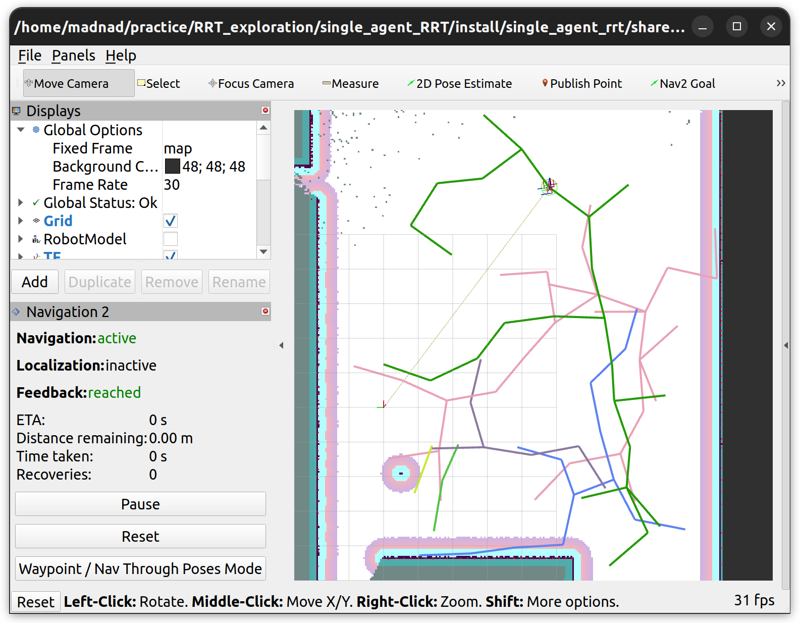
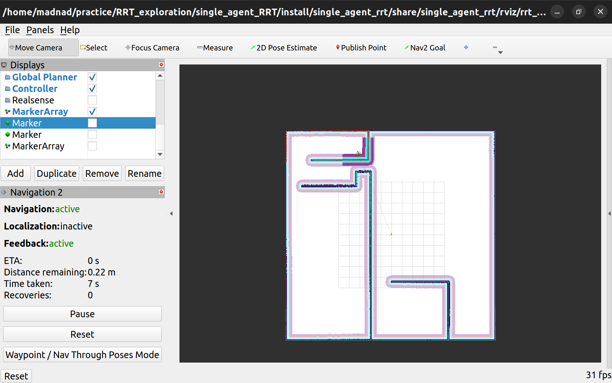

# RRT_exploration

Implementation of autonomous exploration based on RRT (Rapidly Exploring Trees) algorithm using ROS2 and [SLAM Toolbox by Nav2](https://docs.nav2.org/tutorials/docs/navigation2_with_slam.html) framework.
Algorithm is heavily inspired by the [paper](https://ieeexplore.ieee.org/document/8202319) published on **IEEE/RSJ International Conference on Intelligent Robots and Systems (IROS)** in 2017.

This project is just an addition to my Mobile Robot Programming experiments and shouldn't be used as a state-of-the-art exploration algorithm for the real system.

## Dependencies
This project relies on external software:
* `nanoflann` C++11 header-only [library](https://github.com/jlblancoc/nanoflann/tree/master) for building KD-Trees. The code is already contained in the project.
* `PCL Cloud Library` for frontier clustering. Refer to installation instructions [here](https://pointclouds.org/downloads/).

## How to build
Run from the project root directory:
```zsh
home~$ colcon build && source install/setup.bash
```

## How to run
```zsh
home~$ ros2 launch single_agent_rrt rrt_exploration.launch.py
```





## Current issues
* Algorithm finds frontiers very fast in the beginning and as the robot progresses but slows down exponentially when there's not much left to explore.
* Rarely occuring bug in `local_frontier_detector` which I still need to investigate.
* Current implementation of RRT trees visualization works very slowly in rviz2.

## Further steps in implementation
* Previous version of the code used nodes composition. I am planning on bringing it back for convenience.
* An extra `frontier detection rate` observation block shall be added which tracks the frontier update rate. When the map is almost fully explored and frontier detection rate becomes slow enough to trigger a threshold the algorithm switches from building RRT to bruteforce search.
* A special hash map tracking the already explored areas shall be added to filter out these areas in `filter` node.
* Currently I added a custom Costmap2D layer which fixes a bug currently existing in Gazebo Classic simulation. If the bug is fixed for you or you use other versions just disable the layer in [nav2_params](single_agent_RRT/config/nav2_params.yaml):
```yaml
custom_layer:
        plugin: "nav2_custom_costmap_plugin::CustomLayer"
        enabled: False
```
